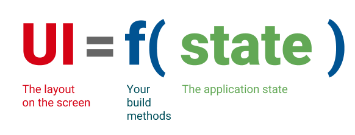

# State Management in Flutter

This repository exhibits some approaches to State Management in Flutter. They are organized in git branches:

* A-SimpleSetState
* B-Provider
* C-BLoC
* D-Login_using_Bloc

## Concept

**State management** refers to the management of the state of one or more user interface controls such as text fields, **OK** buttons, radio buttons, etc, in a graphical user interface. In this user interface programming technique, the state of one UI control depends on the state of other UI controls. For example, a state managed UI control such as a button will be in the enabled state when input fields have valid input values and the button will be in the disabled state when the input fields are empty or have invalid values. As applications grow, this can end up becoming one of the most complex problems in user interface development.

This is especially the case when the state of any particular message or form on the page depends on factors outside of the current page, or available throughout several pages. For example, consider a user who is loggedIn and sees the 'welcome' message on their first visit to any page, but not on subsequent page visits. Does each page manage the state of the user being logged in? That would create too much copy pasting and duplication of code. Instead, you can use a state management pattern for handling messages (this may also include handling error messages and informative messages, along with the described welcome message) and then call this to receive a message as it becomes available.

## Flutter Paradigm

If you’re coming to Flutter from an **imperative framework** (such as Android SDK or iOS UIKit), you need to start thinking about app development from a new perspective.

Many assumptions that you might have don’t apply to Flutter. For example, in Flutter it’s okay to rebuild parts of your UI from scratch instead of modifying it. Flutter is fast enough to do that, even on every frame if needed.

**Flutter is declarative**. This means that Flutter builds its user interface to reflect the current state of your app:

When the state of your app changes (for example, the user flips a switch in the settings screen), you change the state, and that triggers a redraw of the user interface. There is no imperative changing of the UI itself (like widget.setText) — ** you change the state, and the UI rebuilds from scratch**.

**This is what we mean when we say that widgets are immutable. They don’t change—they get replaced**.

The declarative style of UI programming has many benefits. Remarkably, there is only one code path for any state of the UI. You describe what the UI should look like for any given state, once—and that is it.

## Stateless vs Stateful

* Stateless Widgets: the state of the widget CANNOT change over time

* Stateful Widgets: the state of the widget CAN change overtime

## Ephemeral State vs App State

Ephemeral state (sometimes called UI state or local state) is the state you can neatly contain in a single widget.

This is, intentionally, a vague definition, so here are a few examples.
* current page in a PageView
* current progress of a complex animation
* current selected tab in a BottomNavigationBar

Other parts of the widget tree seldom need to access this kind of state. There is no need to serialize it, and it doesn’t change in complex ways. In other words, there is no need to use state management techniques (ScopedModel, Redux, etc.) on this kind of state. All you need is a StatefulWidget.

Using **setState()** and a field inside the StatefulWidget’s State class is completely natural. No other part of your app needs to access _counter. The variable only changes inside the MyHomepage widget. And, if the user closes and restarts the app, you don’t mind that _counter resets to zero.

The kind of State that is not ephemeral, that you want to share across many parts of your app, and that you want to keep between user sessions, is what we call **application state **(sometimes also called shared state).
Examples of application state:
* User preferences
* Login info
* Notifications in a social networking app
* The shopping cart in an e-commerce app
* Read/unread state of articles in a news app

For managing app state, you’ll want to research your options. Your choice depends on the complexity and nature of your app, your team’s previous experience, and many other aspects. Here's some options:

* setState
* InheritedWidget & InheritedModel
* Provider & Scoped Model
* Redux
* Bloc/Rx
* MobX

### Resources:

- [State Management: Flutter Oficial Documentation](https://flutter.dev/docs/development/data-and-backend/state-mgmt)
- [Flutter TDD Clean Architecture](https://resocoder.com/category/tutorials/flutter/tdd-clean-architecture/)
- [Bloc by Felix Angelov](https://bloclibrary.dev/#/)
- [Flutter & Firebase App Tutorial by The Net Ninja](https://www.youtube.com/playlist?list=PL4cUxeGkcC9j--TKIdkb3ISfRbJeJYQwC)
- [The Complete Flutter Development Bootcamp Using Dart by App Brewery](https://www.appbrewery.co/p/flutter-development-bootcamp-with-dart)

For help getting started with Flutter, view our
[online documentation](https://flutter.dev/docs), which offers tutorials,
samples, guidance on mobile development, and a full API reference.
