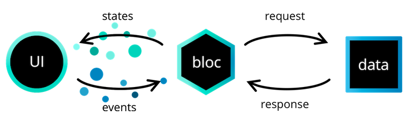

# Flutter Login Tutorial

Login Flow in Flutter using the Bloc library.

## Dependencies

* flutter_bloc
* bloc_test

## VSCode Extension

Provides tools for creating blocs
* bloc by Felix Angelov

# Why Bloc?

## CLEAN Architecture and SOLID Principles

#### Reso Coder's Flutter Clean Architecture Proposal

### Presentation Layer

**Presentation layer** contains the UI in the form of Widgets and also the presentation logic holders, which can be implemented as a ChangeNotifier, Bloc, Reducer, ViewModel, MobX Store...
This tutorial will implement the **BLoC pattern** using the **flutter_bloc** package.

# BLoC

**BLoC**, also written as BLoC is an abbreviation for **Business Logic Component**. Following the *Reso Coder's Clean Architecture Proposal*, he claims it should rather be called a PLoC (Presentation Logic Component), because all the **business logic** is in the **domain layer**, after all.

Nevertheless, BLoC (as proposed by *Felix Angelov*) also claims that it allow us to separate our application into three layers:
* Presentation
* Business Logic
* Data
    * Repository
    * Data Provider

#### BLoC Architecture

The **presentation layer's** responsibility is to figure out how to render itself based on one or more bloc states. In addition, it should handle user input and application lifecycle events.

The **business logic (bloc)** layer's responsibility is to respond to events from the presentation layer with new states. The bloc layer can depend on one or more repositories to retrieve data needed to build up the application state.
​Every bloc has a state stream which other blocs can subscribe to in order to react to changes within the bloc.

Finally, the **data layer's** responsibility is to retrieve/manipulate data from one or more sources: The **repository layer** is a wrapper around one or more data providers with which the Bloc Layer communicates. The **data provider's** responsibility is to provide raw data. The data provider should be generic and versatile.

# Login Tutorial

Here we build a Login Flow in Flutter using the Bloc library.
In this project we will buid two BLoCs, one for the Authentication Flow and other for the Login Flow.

# Authentication

## Authentication States

A user's authentication state can be one of the following:

* **AuthenticationInitial** - waiting to see if the user is authenticated or not on app start.
* **AuthenticationInProgress** - waiting to persist/delete a token
* **AuthenticationSuccess** - successfully authenticated
* **AuthenticationFailure** - not authenticated

Each of these states will have an implication on what the user sees. For example:

* if the authentication state was **AuthenticationInitial**, the user might be seeing a splash screen.
* if the authentication state was **AuthenticationInProgress**, the user might be seeing a progress indicator.
* if the authentication state was **AuthenticationSuccess**, the user might see a home screen.
* if the authentication state was **AuthenticationFailure**, the user might see a login form.

It's critical to identify what the different states are going to be before diving into the implementation.

The equatable package is used in order to be able to compare two instances of AuthenticationState. By default, == returns true only if the two objects are the same instance.

## Authentication Events

Now that we have our AuthenticationState defined we need to define the AuthenticationEvents which our AuthenticationBloc will be reacting to.

We will need:

* an **AuthenticationStarted** event to notify the bloc that it needs to check if the user is currently authenticated or not.
* an **AuthenticationLoggedIn** event to notify the bloc that the user has successfully logged in.
* an **AuthenticationLoggedOut** event to notify the bloc that the user has successfully logged out.

## Authentication Bloc

Now that we have our AuthenticationState and AuthenticationEvents defined, we can get to work on implementing the AuthenticationBloc which is going to manage checking and updating a user's AuthenticationState in response to AuthenticationEvents

Just from reading the class definition, we already know this **bloc is going to be converting AuthenticationEvents into AuthenticationStates**.

Our AuthenticationBloc has a dependency on the UserRepository.

# Login

Because the LoginForm will have to handle user input (Login Button Pressed) and will need to have some business logic (getting a token for a given username/password), we will need to create a LoginBloc.

Just like we did for the AuthenticationBloc, we will need to define the LoginState, and LoginEvents. Let’s start with LoginState.

## Login States

* **LoginInitial** is the initial state of the LoginForm.

* **LoginInProgress** is the state of the LoginForm when we are validating credentials

* **LoginFailure** is the state of the LoginForm when a login attempt has failed.

Now that we have the LoginState defined let’s take a look at the LoginEvent class.

## Login Events

**LoginButtonPressed** will be added when a user pressed the login button. It will notify the LoginBloc that it needs to request a token for the given credentials.

## Login Bloc

LoginBloc has a dependency on **UserRepository** in order to authenticate a user given a username and password.

LoginBloc has a dependency on **AuthenticationBloc** in order to update the AuthenticationState when a user has entered valid credentials.

Now that we have our LoginBloc we can start working on LoginPage and LoginForm.

